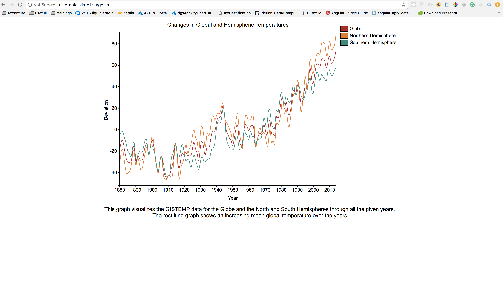
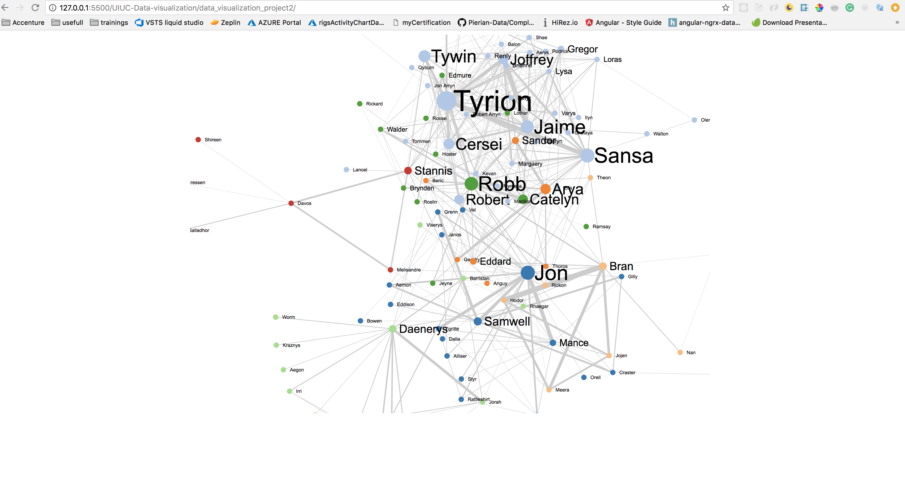

# UIUC-Data-visualization

**Data-visualization**
Project 1 assigment.
I visualized some data as a chart. The dataset deals with world temperatures and comes from NASA. I used D3.js to create a chart.

To see the live demo, please [click here](http://uiuc-data-vis-p1.surge.sh/)

Project 2 assigment.
I used Kaggle's Game of Thrones dataset and D3.js to plot the data. This representation of the data helps to asnwer these questions:
_ How many connections does each person has?
_ Who is the most influential person in GoT?

